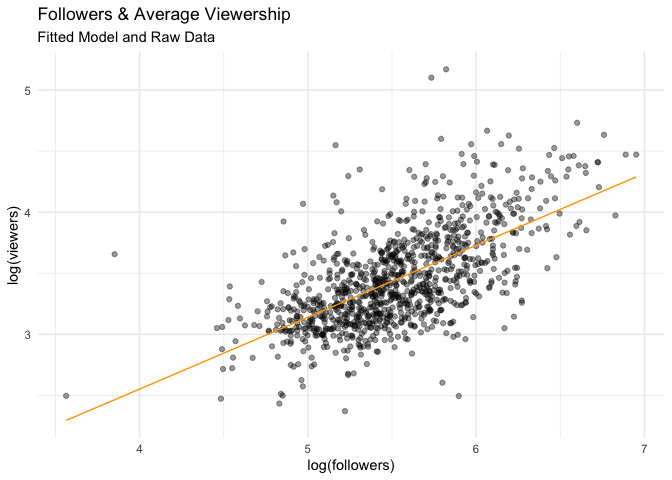

# Chapter 5

We are getting into more complex topics, like how to fit and interpret models. In this section, we will use all the tools we have learned - from wrangling to visualization - to make sure we fit appropriate models and that we understand what these models are doing. Models can be powerful inferential tools but they can also be misleading (like anything). It is important that we know what is powering the machinery we are using so that we always know whether to trust the results we get. 

In this homework, we are going to be analyzing twitch data. We will learn a couple of tricks for modeling data along the way. 

Let's begin by loading the data in our usual way. 


```r
library(tidyverse)

twitch_data <- read_csv("../Data/twitchdata-update.csv")
```

The names of the variables here are a bit annoying. They are capitalized and have spaces which makes them awkward to work with in `R`. Let me show you a neat trick. First, install a package called `janitor` if you don't have it yet. Then, let's load it and clean the names. 


```r
library(janitor)
twitch_data <- clean_names(twitch_data)

# Inspect new names
colnames(twitch_data)
```

```
##  [1] "channel"             "watch_time_minutes"  "stream_time_minutes"
##  [4] "peak_viewers"        "average_viewers"     "followers"          
##  [7] "followers_gained"    "views_gained"        "partnered"          
## [10] "mature"              "language"
```

Look at how much better they look. We are ready to begin our analysis. 

## Question 1 

We will begin with an easy question. An almost obvious question. We are going to examine whether the number of followers a streamer has is predictive of the average viewers they get. Following what the chapter told us, let's look at the raw data. Show me the `average_viewers` and the `followers` for five random streamers. What do you notice? 

Now, let's summarize these two variables. An alternative way you get a summary of your variables of interest is by running `summary()` on them. `Select` our two variables of interest and run `summary()`. Describe the results in a few words. Does anything capture your attention? 

Okay, lastly - but perhaps most importantly - lets visualize the data. Make a scatterplot with our two variables of interest. 

What do you notice? 

Right away, you should notice that the data is packed into a small part of the Cartesian plane. Why? Because we have an uneven distribution - a few channels with a lot of followers and a lot of average viewers. So what should we do? We can transform the data. Remember the `scale_x_log10` trick we learned in the last book? Let's apply it. Make the same plot but adding `scale_x_log10` and `scale_y_log10`. What do you see now? How does the relationship look like?

Hopefully you have learned something important here: often the relationship between two variables is not immediately obvious and we need to do some transformations of the data to uncover it. Let's add those transformed variables to our dataset. 


```r
twitch_data <- twitch_data %>% 
  mutate(log_viewers = log(average_viewers), 
         log_followers = log(followers))
```

## Question 2 

Let's actually run a regression. Using `lm()` fit a model where you predict the logarithm of average viewers (`log_viewers`) using the logarithm of followers (`log_followers`). Save the results to an object called `fit1`.

I am going to show you another way of getting a summary of your model. First, let's install the `broom` package. After, run `tidy()` on your model object (`fit1`). 

Before I have you describe your results I have to tell you that when you transform your variables, interpretation is a bit different. In the situation we are in - where your outcome and explanatory variables have been logged - the coefficients are interpreted as percentage increases. For example, let's say we have a coefficient of $0.4$. We would do the following: 

$$ 1.1^{0.4} = 1.03886 $$

And we would interpret our coefficient like this: 

> A 10% increase in followers is associated with a 3.9% increase in the average number of viewers. 

Now, it's your turn. Take the coefficient from your model and interpret it in this way. 

## Question 3 

Okay, now let's look at our line of best fit and check the residuals. I am again going to introduce you to an incredibly useful tool from the `broom` package called `augment`. Run the following code: 


```r
library(broom)

pred_data <- augment(fit1)

# glimpse our new data 
glimpse(pred_data)
```

```
## Rows: 1,000
## Columns: 8
## $ log_viewers   <dbl> 10.229765, 10.150738, 9.303466, 8.950792, 10.295597, 10.…
## $ log_followers <dbl> 14.99303, 15.48513, 14.38515, 15.18792, 16.00592, 14.262…
## $ .fitted       <dbl> 9.278867, 9.568470, 8.921137, 9.393563, 9.874953, 8.8488…
## $ .resid        <dbl> 0.9508978, 0.5822677, 0.3823296, -0.4427705, 0.4206438, …
## $ .hat          <dbl> 0.006194481, 0.008694557, 0.003782169, 0.007126066, 0.01…
## $ .sigma        <dbl> 0.7104812, 0.7108819, 0.7110196, 0.7109838, 0.7109968, 0…
## $ .cooksd       <dbl> 0.0056128779, 0.0029688873, 0.0005513456, 0.0014026033, …
## $ .std.resid    <dbl> 1.3420109, 0.8227954, 0.5389316, -0.6251793, 0.5953620, …
```

Look, it's our original data but also a bunch more information. The `.fitted` column includes our predictions given our line of best fit. `.resid` contains the residuals. Let's visualize our line of best fit: 


```r
pred_data %>% 
  ggplot(aes(x = log_followers, 
             y = log_viewers)) +
  geom_jitter(alpha = 0.4) + 
  geom_line(aes(x = log_followers, 
                y = .fitted), 
            col = "orange") + 
  theme_minimal() +
  labs(subtitle = "Fitted Model and Raw Data", 
       title = "Followers & Average Viewership", 
       x = "log(followers)", 
       y = "log(viewers)")
```

<!-- -->

Do you think our model describes the relationship well? 

Now, you fit a plot where `log_followers` is in the x-axis and `.resid` is in the y-axis.

What do you see? Are there any big residuals? Do they happen often in a particular range of our x-variable? If so, we would have a problem: our model would systematically fail to predict part of our data. 

## Question 4 

Let's now look at regression using one categorical variable to predict one continuous variable. Here, I am interested in whether `language` predicts `average_viewers`. This would give us an indication of where the most popular twitch channels come from. I have a hunch that English streamers might be the most popular. Let's see. 

First, describe our variables of interest as we did above. I am going to give you less guidance here. I want you to explore: 

1) The raw data
2) Summaries of the variables
3) Plot the variables

## Question 5 

Now, we are ready to fit the model. Fit a linear regression where your outcome variable is `average_viewers` and your independent variable is `language`. Let me teach you another trick here. When your categorical variable has many categories it makes sense to establish your reference category *outside of the model*. This ensures that, when you are reading your coefficients, you know what you are comparing them to. Let's set `English` as our reference category. 


```r
twitch_data <- twitch_data %>% 
  mutate(language = as.factor(language), 
         language = relevel(language, ref = "English"))
```

Now, fit your model. Your coefficients will tell you how many more (or fewer) average viewers are related to streaming in languages different than English. 

Interpret the results. How is my prediction doing? 

## Question 6

Explore the residuals here using a similar plot as above. There are a couple of points our model really missed - which ones were they? 

