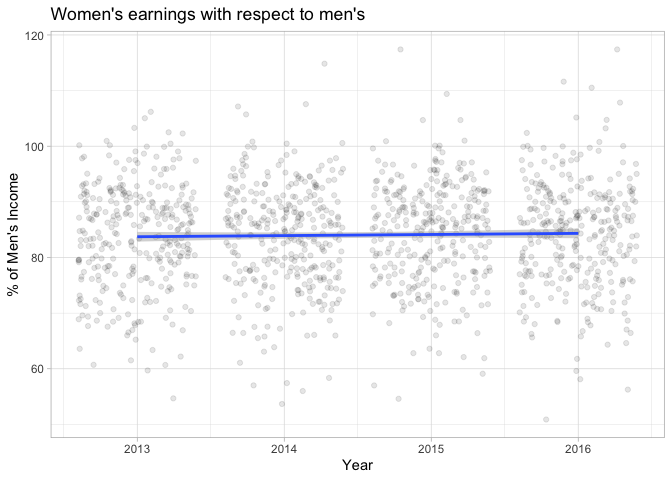

In this set of supplementary exercises, we are going to practice - and expand on - some of the skills and ideas introduced on Chapter 6 of Modern Dive. To do this, we are going to be looking at a dataset that includes information about the employment conditions of women across different occupations. Here, we are going to explore how much women earn with respect to men in different occupations and how this might have changed in the last few years. 

As usual, we will begin by reading in the data and by looking at it. The data is in our course directory. 


```r
library(tidyverse)
# Set our ggplot theme from the outset
theme_set(theme_light())
# Read in the data 
gender_employment <- read_csv("../Data/gender_employment.csv")

# Glimpse at the data 
glimpse(gender_employment)
```

```
## Rows: 2,088
## Columns: 12
## $ year                  <dbl> 2013, 2013, 2013, 2013, 2013, 2013, 2013, 2013, …
## $ occupation            <chr> "Chief executives", "General and operations mana…
## $ major_category        <chr> "Management, Business, and Financial", "Manageme…
## $ minor_category        <chr> "Management", "Management", "Management", "Manag…
## $ total_workers         <dbl> 1024259, 977284, 14815, 43015, 754514, 44198, 10…
## $ workers_male          <dbl> 782400, 681627, 8375, 17775, 440078, 16141, 7287…
## $ workers_female        <dbl> 241859, 295657, 6440, 25240, 314436, 28057, 3683…
## $ percent_female        <dbl> 23.6, 30.3, 43.5, 58.7, 41.7, 63.5, 33.6, 27.5, …
## $ total_earnings        <dbl> 120254, 73557, 67155, 61371, 78455, 74114, 62187…
## $ total_earnings_male   <dbl> 126142, 81041, 71530, 75190, 91998, 90071, 66579…
## $ total_earnings_female <dbl> 95921, 60759, 65325, 55860, 65040, 66052, 55079,…
## $ wage_percent_of_male  <dbl> 76.04208, 74.97316, 91.32532, 74.29179, 70.69719…
```

We have a lot of information about the specific occupation but there are broader categories of employment. We will start by looking at those. 

Before we begin our analysis, it would be useful to take a bird's eye view of the trend we are trying to unpack. In our dataset we have a column called `wage_percent_of_male` which indicates how much money women make with respect to men in that occupation on average. We want to examine how this has changed over time. Here's a simple plot of that value with respect to time.


```r
gender_employment%>% 
  ggplot(aes(x = year, y = wage_percent_of_male)) +
  geom_jitter(alpha = 0.1) + 
  geom_smooth(method = "lm") + 
  labs(title = "Women's earnings with respect to men's", 
       y = "% of Men's Income", 
       x = "Year")
```

<!-- -->
We don't see a lot of fluctuation: the trend is mostly flat albeit with a slight positive slope. What we want to explore is how this relationship varies across occupations. 

## Question 1 

Let's begin by fitting a model where `wage_percent_of_male` is the outcome variable and the explanatory variables are `year` and `major_category`. As we learned in our previous homework, we should always relevel categorical variables with more than one category in order to be sure what the model output is telling us. So let's do that first. Let's make "Management, Business, and Financial" the reference category. Our results will be in comparison to this group. 


```r
gender_employment <- gender_employment %>% 
  mutate(major_category = as.factor(major_category), 
         major_category = relevel(major_category, ref = "Management, Business, and Financial"))
```

Now, fit the model described above and save it as `parallel_model`. Using `tidy()` from the `broom` package, summarize the results. Can we say anything about overall trends by year? 

Interpreting models with multiple categorical variables is not that much different than the examples presented in the book. Here, we have 8 major categories. Adding this explanatory variable is equivalent to adding 7 variables to the model, each of which records whether our occupation belongs to the given category. This is easier to see when written down as an equation. Our line of best fit here could be written as: 

$$ \hat{y} = \beta_0 + \beta_1 \times \text{year} + \beta_2 \times \text{occ2} + \beta_3 \times \text{occ3}...+ \beta_8 \times \text{occ7} $$
So each coefficient of our model is associated with a binary variable that is either 0 or 1 and that indicates membership in an occupation group with a 1. You can think about these coefficients as switches. Because an occupation only belongs to one category at any time, it has a 1 for one of those values and a zero on all other ones. Multiplying anything by 0 makes it 0 - the betas for the categories to which our occupation does not belong then get "turned off", being multiplied by 0. The only switch that stays "on" is the one that has a 1 - i.e. the category under which our occupation falls. 

Let me give you an example. "Chief Executives" belong to the category "Management, Business, and Financial". Thus, this observation has a 0 for all other dummy variables for category membership and those betas will play no rule in estimating our value. Wait, but in your model output there's no coefficient for "Management, Business, and Financial". That's because that's our reference category; it is baked into beta 0, the intercept. This is also why I said that adding a categorical variable of 8 categories implies adding 7 coefficients. You get the extra one for free because that's your reference category. The betas then will tell you how much categories differ from your reference group. 

Okay, that was a lot. Now you do some interpretation. Using the coefficients from your model, calculate the wage percentage of male income for Sales and Office occupations on 2015. 

Now calculate the wage percentage of male income for Service occupations on 2016.

## Question 2 

The model above assumes parallel trends. This means that we are saying telling the model to draw a line for each major category, and let the lines start at different points but make the slopes the same. The only thing that changes across major categories then is the intercept of the lines. 

Let's check if this assumption is warranted. Using the code from the introductory section, make a similar plot but facet it by major category so that lines vary across categories. What do you notice? Is the parallel trends assumption warranted? 

## Question 3 

Let's fit another model that includes an interaction between `major_category` and `year`. This will allow the slopes to differ across major categories. Again, use `tidy()` to get the summary of the results. 

Let's think a bit about what this model says with an equation. We are doubling our coefficients: we have betas for 7 of 8 categories and betas for their respective interaction. Our equation would look something like this: 


$$ \hat{y} = \beta_0 + \beta_1 \times \text{year} + \beta_2 \times \text{occ2} + \beta_3 \times \text{occ3}...+ \beta_8 \times \text{occ7}  + \beta_9  \times \text{occ2} \times \text{year} + \beta_{10} \times \text{occ3} \times \text{year}... \beta_{16} \times \text{occ7} \times \text{year}$$

What does this mean? Occupation 2 in our case is "Computer, Engineering, and Science". For this occupation, then, only four betas are "switched on": beta 0, beta 1, beta 2, and beta 9. If we want to calculate our estimate for the "Computer, Engineering, and Science", for 2016, we would do the following: 

$$ \hat{y} = \beta_0 + \beta_1 \times 2016 + \beta_2  + \beta_9 \times 2016$$

So tell me what the estimate would be for "Computer, Engineering, and Science" for 2016. What about the same estimate but for "Service"? Do you notice any differences? 

## Question 4 

Given that we have the ability to add interactions to models - i.e. to have slopes vary across categories -, why would we choose to build a model that assumes parallel trends? 

## Question 5 

Let's now think about a model that includes two continuous variables as explanatory variables. Here, we are still interested in predicting how `wage_percent_of_male` has changed across years. Let's start simple: build a model where `wage_percent_of_male` is the outcome variable and `year` is the explanatory variable and save it as `simple_fit`. Then, use `tidy()` to look at the model output. Briefly, describe the results. 

Let's add the other variable in there. We want a model that takes into account the variable `percent_female`. This variable records what percentage of the workforce of a given occupation is made up of women. The thinking behind this addition is that the proportion of women in an industry might affect how much the gender paygap has changed across the last few years. 

Before we build the model we want to explore the relationship between these variables. Like in the chapter, use `select()` and `cor()` to find the correlations between these three variables. Because we have some missing values, you want to give `cor()` the argument `use = "complete.obs"`. 


```r
gender_employment %>% 
  select(year, wage_percent_of_male, percent_female) %>% 
  cor(use = "complete.obs")
```

```
##                             year wage_percent_of_male percent_female
## year                 1.000000000           0.02403895    0.004998286
## wage_percent_of_male 0.024038950           1.00000000    0.111464461
## percent_female       0.004998286           0.11146446    1.000000000
```

Describe the relationships between the variables. 

What we want to to know, however, is the relationship between year and the paygap **conditional** on the proportion of women who work in an occupation. This is where the model described above comes handy. Build that model and save it as `multiple_fit`. Then, use `tidy()` to summarize the results. Describe the results in your own words. Is this what you would have expected? 

## Question 6 

Here, we will practice some model comparison and I will also introduce you to another useful tool from the `broom` package. 

First, let's review the discussion about R squared. Briefly tell me, in your own words, what R squared is. 

Okay, let's now compare the R squared for `simple_fit` and `multiple_fit`. To do this we are going to use `glance()` from the `broom` package. Run `glance()` on `simple_fit`. This should give you a lot of information, including the R squared. It turns out that you can save that output doing something like this. 


```r
simple_glanced <- glance(simple_fit)
```

And then you can access the R squared, the same way you would access a column from a dataframe, with the `$` sign. 


```r
simple_glanced$r.squared
```

Do this for both models and compare the R squared. What can you conclude from this?

## A warning sign

Now, I want to tell you a cautionary tale about R squared. While a useful metric, R squared has one big weakness: it improves when you add any variable to your model, regardless of how non-sensical it is. This is because R squared just takes into account the amount of variance explained and even random noise will be able to account for some variation. Let's see this in action. I am going to create a vector of random values the same size as our dataframe. 


```r
random_numbers <- rnorm(n = nrow(gender_employment), 
                        mean = 0, 
                        sd = 4)
```

Now, I will add this column and put it into our model: 


```r
gender_employment$random_noise <- random_numbers

# New model 
random_fit <- lm(wage_percent_of_male ~ year + percent_female + random_noise, data = gender_employment)
```

Examine the R squared for yourself and consider the implications of this little exercise! 


