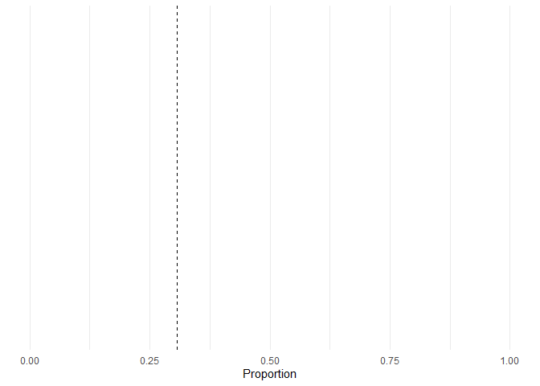
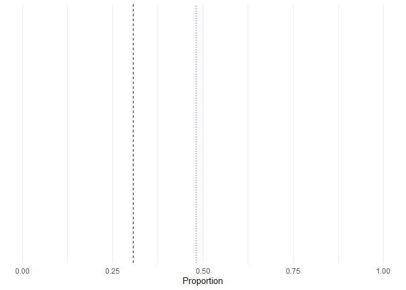
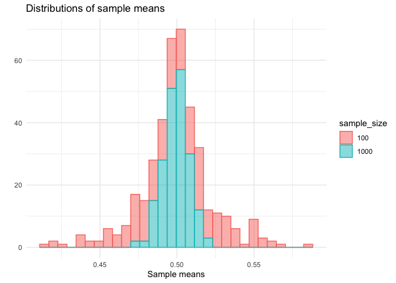

# Chapter 7 

Here, we are going to practice and reinforce some of the ideas that we encountered in chapter 7. Sampling is crucial for understanding any type of data analysis. When you are presented with brand new set of data, it is always useful to think: what groups or populations am I capturing in these data? To what groups or populations can I extrapolate insights I draw from these data? Do I have enough data? To answer these questions, it is essential to grasp sampling; to think about how features of a population might (or might not) make their way to our spreadsheets. 

Say we are interested in finding out the proportion of science Nobel prizes that have been awarded to people born in the US. We could easily Google this, the information is available. But imagine that for some reason we are only able to access portions of the data - i.e. samples. How would we go about finding this proportion and how confident would we be in our findings?

Let's begin by loading in a data frame containing all Nobel prize winners. 


```r
library(tidyverse)
theme_set(theme_minimal())

nobel_winners <- read_csv("../Data/nobel_winners.csv")
```

Given that we are only interested in scientific Nobel prizes, let's get rid of the Nobel Peace prize. We will also create a column that indicates whether the receipient was born in the US. 


```r
nobel_winners_flt <- nobel_winners %>% 
  filter(category != "Peace") %>% 
  mutate(is_us = if_else(birth_country == "United States of America", 1, 0))
```

Now, what is the *true* proportion of US-born Nobel prize winners?


```r
true_prop <- nobel_winners_flt %>% 
  group_by(is_us) %>% 
  summarise(prop = n()/nrow(nobel_winners_flt))

ggplot() + 
  coord_cartesian(xlim = c(0,1), ylim = c(0,1)) + 
  geom_vline(xintercept = true_prop[2,2][[1]], linetype = "dashed")  + 
  labs(x = "Proportion")
```

<!-- -->

Now, let's say our friend gives us a random sample of 25 Nobel winners and we calculate our proportion. How far off would we be? 


```r
set.seed(33)
# Random sample 
our_sample <- sample_n(nobel_winners_flt, 
                       size = 25, 
                       replace = F)

sample_prop <- our_sample %>% 
  group_by(is_us) %>% 
  summarise(prop = n()/nrow(our_sample))

# How does our proportion look like? 
ggplot() + 
  coord_cartesian(xlim = c(0,1), ylim = c(0,1)) + 
  geom_vline(xintercept = true_prop[2,2][[1]], linetype = "dashed")  + 
  geom_vline(xintercept = sample_prop[2,2][[1]], linetype = "dotted", col = "red") +
  labs(x = "Proportion")
```

<!-- -->

We are way above, almost at 50%! 

## Question 1 

Let's explore some of the vocabulary provided in the chapter. 
- In this scenario, what is the population? 
- What is the sampling frame? 
- What does the black line represent? (hint: the word population is in the name). 
- What does the red line represent? 

## Question 2 

Okay, you probably know what we are doing next. We are going to take repeated samples of differing sizes and explore what the results look like, much like we did in the chapter. This will reinforce the ideas of sampling variability and sample size, which are key. I am going to give you a challenge though: instead of using the modern dive functions, we will write our own. 

We want a function that takes a data set and a sample size and returns the desired sample. Here's a partial writing of the function. You finish it. 


```r
return_sample <- function( ___ = 25, 
                           dataframe, 
                           ___) {
  all_samples <- c()
  
  for (i in 1:reps) {
  our_sample <- sample_n(___, 
                         size = size_num, 
                         replace = F)
  
  prop_sample <- ___ %>% 
    group_by(___) %>% 
    summarise(prop = n()/nrow(___))
  
  all_samples[i] <- ___[2,2][[1]]
  }
  return(all_samples)
}
```

Test the function a couple of times on the console to make sure it is doing what it is supposed to do. 

Using your function, take 50 samples of 25 winners. Plot your results. 

> Bonus: can you add the mean proportion of your samples and the true proportion we calculated above? 

## Question 3 

Now, use your function to take 50 samples of 100 winners each. Plot your results in the same way that you did above. 

Which one of the two distributions varies more. Can you tell me why? 

## Question 4 

Calculate the standard deviation of your samples collected using a size of 25 and a size of 100. Do these results support your argument above? What does this imply about sample size? What happens to the variability in our estimates as the sample size increases 

## Question 5 

Now, repeat the same steps above to find the proportion of women who have been awarded the Nobel prize. Draw samples of 100 scientists at a time and plot your distribution of proportions. You will have to change our function above so that it groups by another variable this time: gender. 

## Question 6 

Here's another challenge. Below, you'll find some code. It takes samples from a uniform distribution with boundaries 0 and 1. This just means that at any point all values between 0 and 1 are equally likely to be drawn. Then, it computes the mean of the sample. It does this for 200 samples and, lastly, it plots the histogram of the sample means. Explain to me why this is an illustration of the **Central Limit Theorem**. 


```r
# Calculate the means for sample size of 100 
means_rd_100 <- c()
for ( i in 1:200) {
means_rd_100[i] <- mean(runif(n = 100, 
                              min = 0, 
                              max = 1))
}

# Calculate the means for sample size of 1000
means_rd_1000 <- c()
for ( i in 1:200) {
means_rd_1000[i] <- mean(runif(n = 1000, 
                              min = 0, 
                              max = 1))
}

sims_df <- tibble( 
  values = c(means_rd_100, 
             means_rd_1000), 
  sample_size = rep(c(100, 
                      1000), each = 200)
  ) %>% 
  mutate(sample_size = as.factor(sample_size))

sims_df %>% 
  ggplot(aes(x = values, fill = sample_size, color = sample_size)) +
  geom_histogram(alpha = 0.5) +
  labs(x = "Sample means", 
       y = "", 
       title = "Distributions of sample means")
```

<!-- -->


