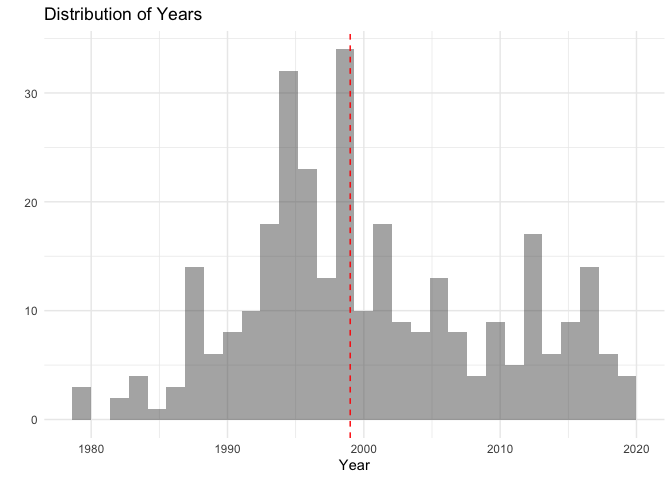
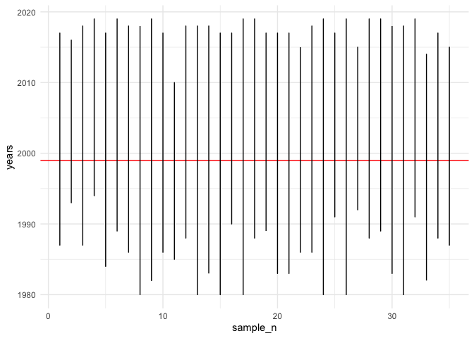

At this point you have the right to be mad at me. After going through chapter 8, you probably realized that I had you doing resampling in the complementary exercises for chapter 7. Plus, I made you do it so many times. Let's practice it one more time, but this time armed with the language we were taught in chapter 8. 

Here, we are going to use a dataset that contains the results of a survey conducted where artists and folks in the music business listed their favorite rap tracks. For each track we have information about its release data, and what we are going to do is to examine what is the year of that shows up the most - i.e. we are going to try to find out the year when rap peaked. This is not a silly attempt to make a data analysis course more interesting or relatable, this is a real issue in the sociology of culture and consumption. We have evidence [that music sales are higher for old music](https://www.theatlantic.com/ideas/archive/2022/01/old-music-killing-new-music/621339/). Nostalgia is the name of the game. A lot of people really believe that old music was better and organizing their music-listening habits around this idea. So understanding where supposed "experts" place the peak of rap is important and interesting. 

We are also going to use a dataset that contains about 300 penalty kicks taken throughout the history of the soccer world cup. A penalty in soccer is a big deal. Folk wisdom is that is practically a goal. In reality, the chances of scoring a penalty is about 0.7 which is still huge given how low-scoring soccer is (and people who don't like soccer will remind you about how low-scoring is). We will examine the proportion of penalties that have been actually scored and the confidence we can have in our inference. 

Let's begin by importing the data. 


```r
library(tidyverse)
theme_set(theme_minimal())
rap_artists <- read_csv("../Data/rap_artists.csv")
```

Now, let's plot the distribution of years as well as the median. 


```r
median_year <- median(rap_artists$year)

rap_artists %>% 
  ggplot(aes(x = year)) +
  geom_histogram(alpha = 0.5) +
  geom_vline(xintercept=median_year, col = "red", linetype = "dashed") +
  labs(x = "Year", 
       y = "", 
       title = "Distribution of Years")
```

<!-- -->

Okay, we know what our target of knowledge is: 1999. Let's resample and see how well we can capture it. 

## Question 1 

Let's make a function that samples a certain number of songs and extracts the years. I'll give you the skeleton and you finish it. 


```r
take_years <- function(dataframe, ___) {
  yrs <- ___ %>% 
    sample_n(., size = n) %>% 
    pull(___)
  return(yrs)
}
```

Okay, so now I want you to make the following plot: 

<!-- -->

I'll give you code with some blank and you have to finish it so that it produces the same plot. 


```r
set.seed(9898)

samples <- tibble()

for (i in 1:35) {
  yrs <- ___(rap_artists, 5)
  yrs_df <- tibble(
    sample_n = ___, 
    years = ___
  )
  samples <- rbind(samples, yrs_df)
}

samples %>% 
  ggplot(aes(x = sample_n, 
             y = years, 
             group = ___)) +
  geom_hline(yintercept = ___, col = "red") +
  ___() 
```

Okay, now that you can plot this, let's think about the results. We were selecting a very small sample each time: only 5. Did any of our intervals not capture the median year of the original dataset? 

## Question 2 

Before we jump into some analysis, let's review some vocabulary. 

What is a confidence interval? 

What denotes more confidence: a narrow or a wide confidence interval?

## Question 3

Often, we are interested in a specific statistic. In this case, we want to look at the median year of our subsamples. Let's modify the function above so that it calculates that. 


```r
take_years <- function(dataframe, ___) {
  yrs <- ___ %>% 
    sample_n(., size = n) %>% 
    pull(___)
  return(median(yrs))
}
```

Now, you are on your own. Using a for loop (or your preferred method of iteration) calculate the median year for 500 sub-samples of 25 songs each. Plot the resulting histogram. 

## Question 4

The chapter teaches you a neat heuristic: that your 95% confidence interval can be calculated by taking the median (or mean) and adding 1.96 standard deviations (for the upper limit) and subtracting 1.96 standard deviations (for the lower limit). Using this, and *without* using the chapter's helper functions, calculate the 95% confidence interval of your sample medians from question 2. 

Using the interpretation that the chapter gives you, tell me what that 95% confidence interval means.

## Question 5

Now, one of the things of working with samples is that you can make more tangible calculations on them. Use the `percentile method` to construct a 95% confidence interval of your sample medians. 

What do you notice? Are these results similar than those you got above? Do they differ much? 

## Question 6

Okay, let's go back to my spiritual home: the soccer World Cup. I have a dataset of around 300 penalties shot at the competition throughout its history. I want you to use bootstrapping to tell me what is the proportions of penalties scored. 

Let's read in the data. 


```r
penalties <- read_csv("../Data/WorldCupShootouts.csv")
penalties <- penalties %>% 
  drop_na()
```

This is the true proportion of penalties scored. 


```r
mean(penalties$Goal)
```

```
## [1] 0.6989247
```

Modify the function and code above so that you can calculate the proportion of goals scored for 500 samples of 50 penalties. 

Calculate the 95% confidence interval of your sampled proportions. 

How confident are you that the probability of scoring a penalty kick in the World Cup is around 70%? 


